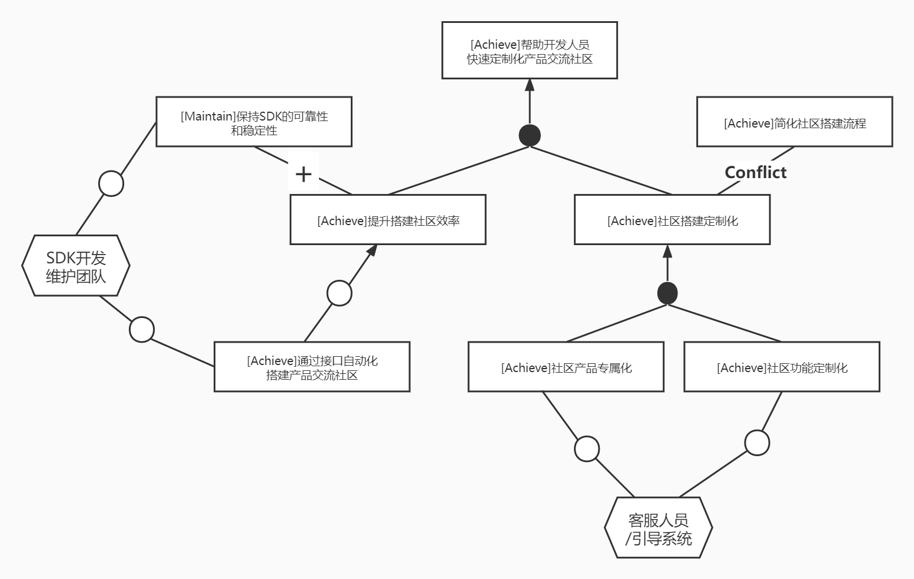
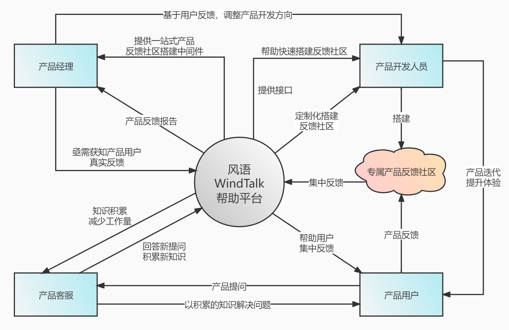

## 〇、待完成任务

#### 第一阶段

- 目标模型分析
  - 目标模型：帮助开发人员快速定制化产品交流社区（产品侧）√

- 项目前景与范围
  - 项目前景 √

## 一、完成内容

### 2 目标模型分析

#### 2.2 帮助开发人员快速定制化产品交流社区

##### 2.2.1 目标精化

要实现帮助开发人员快速定制化产品交流社区这一高层次目标，可以将其细分为提升搭建社区的效率以及社区搭建定制化。提升搭建社区的效率对产品初期迭代开发中具有重要意义，产品团队可以及时得到用户反馈，并在下次迭代中作出相应调整；社区搭建的定制化则可以在一定程度上避免用户对产品的反馈过于分散的问题，同时为用户提供可靠的反馈渠道，避免产品团队陷入搞不清需求真伪、过度设计的误区。由此，精华为AND关系下的子目标。

再次进行细分，对于提升搭建社区效率，主要目标就是希望有一个开发团队可以直接调取的接口，利用此接口即可自动化地构建出对应产品的交流社区（OR精化）；对于社区搭建定制化来说，主要可以分为两个子目标，一是社区产品专属化，即通过调用接口构建的社区只服务于本产品，并帮助产品在后续开发过程中及时得知用户反馈并进行改进，二是社区功能定制化，即产品团队可以根据在不同迭代周期对产品交流社区的不同需求对搭建的社区进行功能定制，从而满足产品开发的渐进需求（AND精化）。

##### 2.2.2 目标冲突与协作

根据进一步对整体目标的分析，我们识别出了一些其他目标，如简化产品社区搭建的流程以达到“快速”搭建的目的，以及保持风语SDK的可靠性、稳定性等。但在社区搭建定制化的过程中，往往需要使用者进行较为详细化的功能搭配、筛选等，与简化搭建流程的目标产生冲突；保持风语SDK的可靠性和稳定性则是提升搭建社区效率的一项保证，体现了目标间的协作。

##### 2.2.3 目标实现

最后将低层最精细的目标分配给不同主体：为了提供SDK以供开发者团队自动化搭建产品交流社区，并保证SDK的可靠性和稳定性，需要有专业的SDK开发和维护团队；要达到社区功能定制化和社区产品专属化的目标，还需要有专业的客服团队和引导系统进行定制引导。

同时设计最底层目标的操作：为实现通过接口自动化搭建产品交流社区的目标，需要进行SDK中间件开发；为保持SDK的可靠性和稳定性，需要对其进行维护和更新；同时为了实现社区产品专属化的目标，就要保证不同产品社区之间的隔离以及资源的合理分配；最后，为了实现社区功能定制化，SDK需要提供定制功能。

### 3 项目前景与范围

#### 3.2 项目前景

##### 3.2.1 前景概述

风语是一个一站式用户反馈与帮助平台，其主要任务是帮助企业与开发者快速搭建起功能强大的用户反馈与帮助社区，实现用户问题的快速解答、用户需求的及时反馈，从而帮助产品开发者洞察客户需求，为企业降本增效，实现更好的用户体验。

在用户侧，风语致力于改变传统的帮助功能与客服功能的业务形态，为每个独立产品提供专属反馈社区，将用户与开发、产品、客服聚合起来，并希望通过智能推荐辅助+用户主动搜索的方案加快用户问题解决。风语还致力于解决产品团队客服面临的大量重复问题等困扰，通过知识积累、智能引导等方式帮助减轻客服工作量。

在产品侧，风语平台的系统会自动化收集优质问题与解答，定期汇总为产品报告推送给对应产品开发团队，帮助开发者快速定位产品问题，获知用户需求，辅助产品迭代改进。风语平台通过一键启动平台与集成SDK的方式帮助中小型产品开发团队快速搭建定制化产品社区。

##### 3.2.2 提出系统特性的依据——确定解决方案

通过与甲方进行面谈，并充分地进行小组讨论后，我们对每一个问题有了明确一致的解决方案。

| 要素         | 内容                                                         |
| ------------ | ------------------------------------------------------------ |
| ID           | P1                                                           |
| 解决方案描述 | 系统为各产品用户提供进行产品集中反馈的社区；系统提供快速搭建产品定制化反馈社区的中间件；系统根据产品团队的需求提供定制化搭建功能 |
| 业务优势     | 开发团队无需额外耗费精力和成本搭建社区，而只需通过调用接口、定制功能来快速搭建属于自己产品的用户反馈社区；专属的社区可以集中反馈，增强用户粘性，并能帮助产品经理获知真实的用户反馈，并针对性地调整产品开发方向 |
| 代价         | 软件产品开发团队学习使用系统提供的中间件需要一定的时间精力   |

| 要素         | 内容                                                         |
| ------------ | ------------------------------------------------------------ |
| ID           | P2                                                           |
| 解决方案描述 | 系统引入关键智能引导算法，对产品用户的提问或反馈进行智能引导和辅助筛选；系统对各产品社区的用户提问及客服回答进行知识积累 |
| 业务优势     | 平台在选择相应的算法时，会优先选择较为成熟的筛选和引导算法，尽量避免使用不成熟的AI技术，这样可以协助系统进行软件产品的开发维护，保证合理筛选优质的用户反馈信息并总结相应的反馈数据分析报告，提升开发团队软件维护效率；同时，既可以帮助用户快速解决问题，又能根据用户提问和反馈积累知识，减少客服工作量，避免大量重复问题堆积到客服处 |
| 代价         | 系统要对各个智能引导算法进行反复测试，并从中选择最佳算法以保证用户体验 |

| 要素         | 内容                                                         |
| ------------ | ------------------------------------------------------------ |
| ID           | P3                                                           |
| 解决方案描述 | 系统提供的社区搭建中间件易用高效；系统提供的社区搭建中间件持续更新完善；系统为产品团队进行初步社区搭建指引；系统为产品团队定制化搭建提供定制咨询 |
| 业务优势     | 避免冗长的软件使用说明文档，先从初步的搭建指引逐渐引导产品团队和用户熟悉平台，以简洁、易用的接口先行搭建社区，如果后续产品团队仍有定制化社区功能的需求，平台将有专门的咨询功能进行搭建指导，防止用户面对冗长的文档而放弃使用平台，在增强用户粘性的同时完善相关软件产品的维护工作 |
| 代价         | 平台需要简化前期搭建社区的功能，并对平台客服进行专业培训，尽力做到中间件易用高效 |

| 要素         | 内容                                                         |
| ------------ | ------------------------------------------------------------ |
| ID           | P4                                                           |
| 解决方案描述 | 系统定期对各产品社区的用户反馈进行整合；系统为各产品经理定期提供产品反馈报告；系统为各产品客服提供积累的历史知识 |
| 业务优势     | 消除用户对于由风语平台中间件搭建的反馈社区不能真实反馈到开发者、寻求人工客服解答不能及时得到反馈的担忧。系统通过定期整合反馈、将整合后生成的反馈报告发送给产品经理，从而让开发团队得到实时、真实的用户反馈；系统为各产品客服提供积累的历史知识，节约客服回答问题的时间，也让用户得到切实有效的回答 |
| 代价         | 系统需要额外的资源进行整合反馈和历史知识的存储，需要额外的算法和相关机制进行反馈报告的生成 |

| 要素         | 内容                                                         |
| ------------ | ------------------------------------------------------------ |
| ID           | P5                                                           |
| 解决方案描述 | 系统根据产品团队的需求提供定制化搭建功能；系统提供的社区搭建中间件持续更新完善；系统为产品团队定制化搭建提供定制咨询；系统为各产品经理定期提供产品反馈报告 |
| 业务优势     | 产品团队可定制化搭建专属反馈社区，且产品间反馈社区具有独立性，即意味着集中了各产品用户的反馈和提问；同时定制化搭建服务使得产品团队更具针对性地搭建社区，并有专业客服进行指引搭建，每个产品独特的反馈社区也一定程度上摆脱了反馈平台泛用的问题；同时，系统为各产品经理定期提供产品反馈报告，使得产品开发团队能够及时调整开发方向，真正体现反馈社区的作用和价值 |
| 代价         | 系统需要不断更新完善中间件，提供更易用、功能更强大的搭建社区中间件 |

##### 3.2.3 系统特性的确立

在选定解决方案后，我们进一步明确了该解决方案需要具备的功能特征，即系统特性。

| 系统特性编号 | 针对的问题 | 解决方案需要具备的系统特征                       |
| ------------ | ---------- | ------------------------------------------------ |
| SF1          | P1         | 系统提供搭建产品反馈社区的中间件                 |
| SF2          | P1, P5     | 系统根据产品团队的需求提供定制化搭建功能         |
| SF3          | P2, P4     | 系统对各产品社区的用户提问及客服回答进行知识积累 |
| SF4          | P4         | 系统定期对各产品社区的用户反馈进行整合           |
| SF5          | P4, P5     | 系统为各产品经理定期提供产品反馈报告             |
| SF6          | P2         | 系统对产品用户的提问或反馈进行智能引导           |
| SF7          | P2, P4     | 系统为各产品客服提供积累的历史知识               |
| SF8          | P1         | 系统为各产品用户提供进行产品集中反馈的社区       |
| SF9          | P3         | 系统提供的社区搭建中间件易用高效                 |
| SF10         | P3, P5     | 系统提供的社区搭建中间件持续更新完善             |
| SF11         | P3         | 系统为产品团队进行初步社区搭建指引               |
| SF12         | P3, P5     | 系统为产品团队定制化搭建提供定制咨询             |

**最终，确立的系统特性总结如下：**

SF1: 系统提供搭建产品反馈社区的中间件

SF2: 系统根据产品团队的需求提供定制化搭建功能

SF3: 系统对各产品社区的用户提问及客服回答进行知识积累

SF4: 系统定期对各产品社区的用户反馈进行整合

SF5: 系统为各产品经理定期提供产品反馈报告

SF6: 系统对产品用户的提问或反馈进行智能引导

SF7: 系统为各产品客服提供积累的历史知识

SF8: 系统为各产品用户提供进行产品集中反馈的社区

SF9: 系统提供的社区搭建中间件易用高效

SF10: 系统提供的社区搭建中间件持续更新完善

SF11: 系统为产品团队进行初步社区搭建指引

SF12: 系统为产品团队定制化搭建提供定制咨询

##### 3.2.4 假设、依赖、限制

**假设**

AS-1: 中小型软件的产品团队愿意使用风语平台及其提供的SDK

AS-2: 产品团队在使用风语平台后愿意进行适量的反馈

AS-3: 随着软件开发不断推进，产品团队愿意深入使用SDK的更多定制化功能

AS-4: 产品团队在进行定制化构建社区时，愿意为功能更强大的额外服务进行付费

AS-5: 产品团队的产品用户愿意、并逐渐习惯于使用由风语SDK构建的反馈社区

AS-6: 产品团队的产品用户接受、并逐渐习惯于智能引导+主动搜索式的问题反馈解答模式

**依赖**

DE-1: 系统服务器需要托管依赖于第三方云服务提供商以进行社区资源分配和隔离

DE-2: 系统定制化功能的额外付费需要和第三方支付平台进行集成

DE-3: 系统提供的中间件需要用户不断反馈以进行更新和完善

DE-4: 系统需要引入用户智能引导算法帮助用户解决产品使用问题

DE-5: 系统需要引入知识积累算法帮助产品客服进行反馈总结

**限制**

LI-1: 本系统暂不支持代码级跟踪缺陷功能

LI-2: 本系统暂不支持各个产品社区的客户服务部署

LI-3: 本系统目前只面向于中小型软件开发团队及其产品反馈社区搭建

